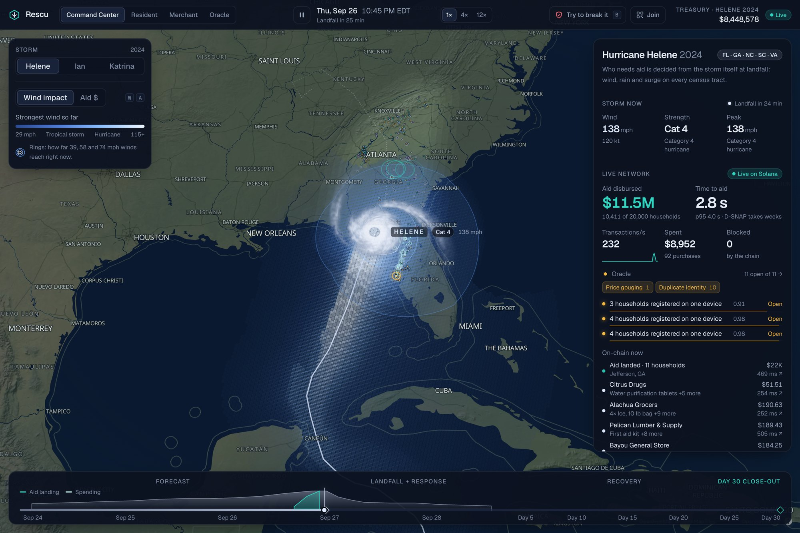
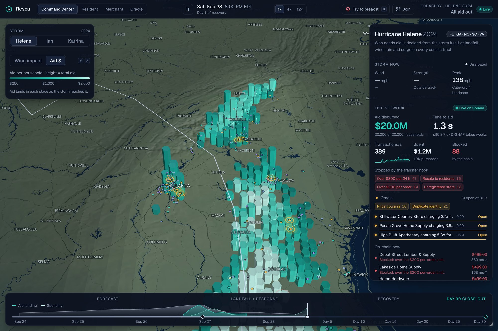
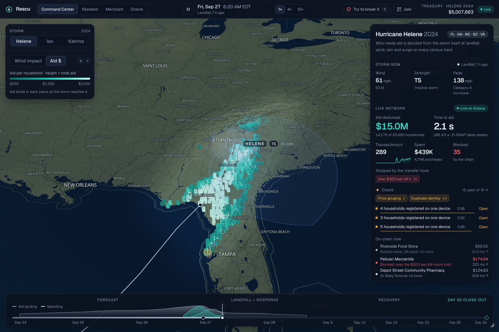
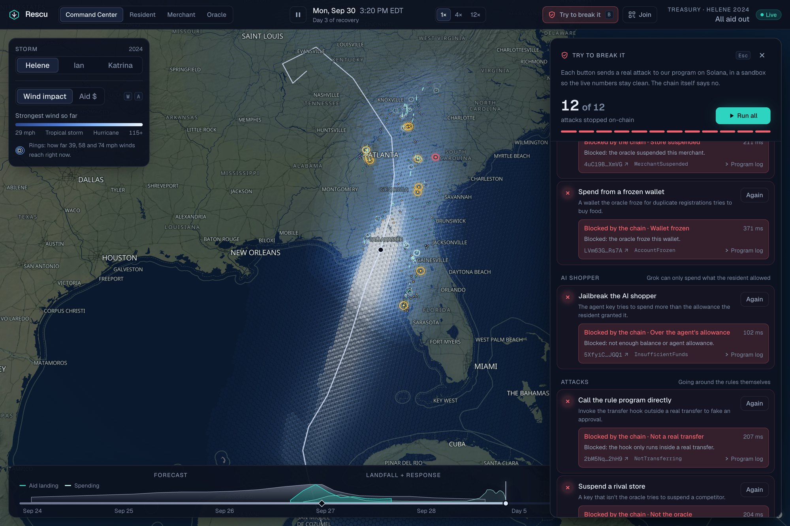
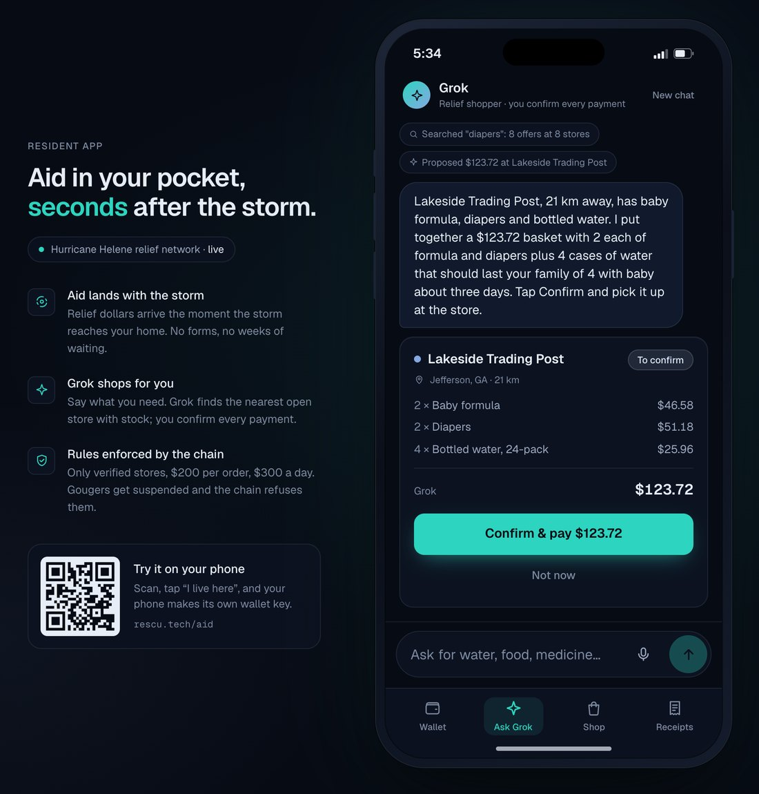
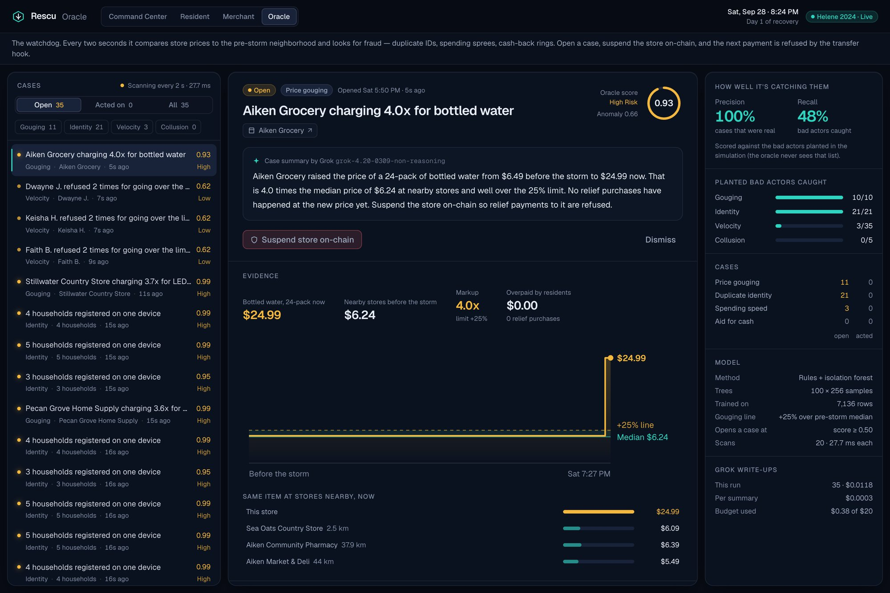
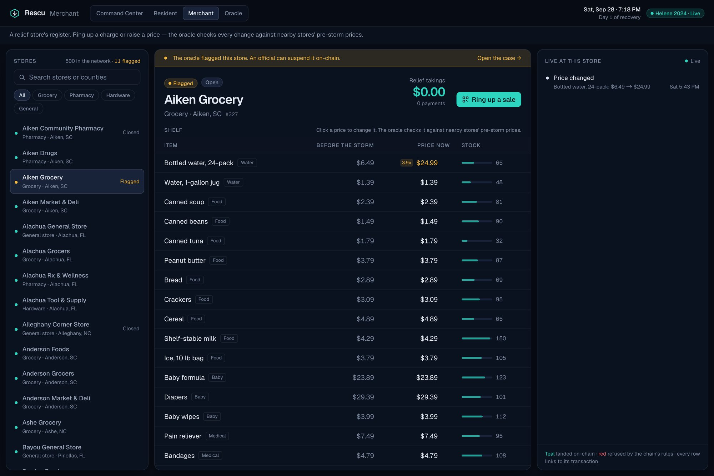
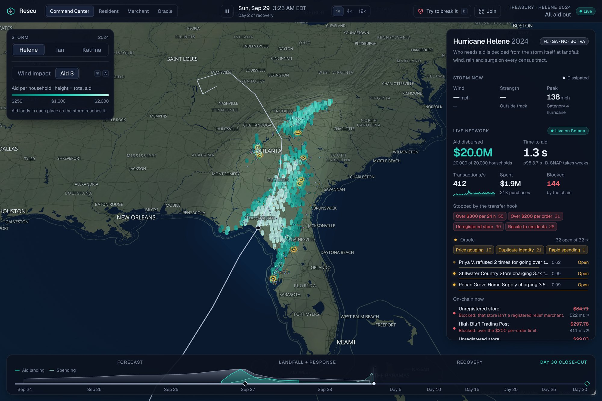

<div align="center">


# Rescu

### Aid airdropped in seconds.

Disaster relief on Solana. When a hurricane reaches a home, relief dollars land in that family's wallet in under a second. They can only be spent at verified local stores, Grok does the shopping, and an ML oracle stops price gouging on-chain.

**[Live demo](https://rescu.tech)** · [Resident app](https://rescu.tech/aid) · [Merchant](https://rescu.tech/merchant) · [Oracle](https://rescu.tech/oracle) · [Program on devnet](https://explorer.solana.com/address/GrxgRShVcGaESyztvHHtaCF8YMXVhK3Wq7AesbQCaLy5?cluster=devnet)

Built solo at HackGT 13 · Sep 25-27, 2026

</div>

---

### ▶ Demo video

> **Coming soon.** The 3-minute walkthrough will be linked here.
<!-- Replace the block above with:
[](https://youtu.be/VIDEO_ID)
-->


<sub>Screenshots are from a live 20,000-household run on rescu.tech. The measured numbers further down are from a separate full benchmark run.</sub>

---

## The problem

Hurricane Helene hit Georgia on **September 26, 2024**. Georgia's disaster food aid (D-SNAP) opened on **October 21**: in person, ID required, and the last counties waited about **seven weeks**.

- FEMA's upfront Serious Needs Assistance is about **$750**, and it comes later.
- After Katrina and Rita, **$600M to $1.4B** of FEMA individual assistance was improper or potentially fraudulent ([GAO](https://www.gao.gov/products/gao-06-844t)).
- After Helene and Milton, Georgia's Attorney General logged about **400 price-gouging complaints**.

So the choice has been fast cash that can be misused, or slow restricted aid that arrives after the worst days are over. Rescu is built to be both **fast and restricted**.

## What Rescu does

**Median 0.93 seconds** from the storm reaching a home to relief dollars confirmed in that household's wallet (measured across 20,000 households on one server).

### 1 · Decides who needs aid, from the storm itself



A multi-hazard model scores all **83,241 US census tracts** on wind, rainfall flooding, storm surge, housing type and social vulnerability. It needs no application form and no FEMA data at decision time.

- **Tested on 23 real US hurricanes** against what FEMA actually approved, on storms the model had never seen. Its county split matched FEMA's with **0.64 overlap vs 0.38** for a wind-only rule, and it did better on **22 of 23** storms.
- **Helene:** 1.56M households in 125 counties, $1.56B at a $1,000 average ($250 to $2,000 each). Rain drove **39%** of the aid, sending the tallest columns into the North Carolina mountains (Buncombe County, Asheville), where the wind was only tropical-storm strength and a wind map would miss them.
- Hover any hex on the map and it explains itself: peak wind, rain, households, and exactly how many dollars go there and why.

### 2 · Airdrops the aid as the storm arrives



One click on **Declare disaster & fund** mints a Token-2022 **Relief Dollar** for that declaration ("Relief Dollar · Helene 2024", rUSD) into a program-owned treasury. From then on, each household is paid the moment the storm's winds reach its neighborhood. Places hit only by rain are paid 12 hours after landfall.

- Residents hold **0 SOL**. A relayer pays every fee.
- Every aid payment, purchase and refusal is a real Solana transaction, and every row in the live feed links to the explorer.

### 3 · Enforces the rules inside the token itself



A Token-2022 **transfer hook** is the checkout. Every relief-dollar payment runs our Anchor program, which refuses anything outside the rules. No server check is involved.

| Rule | Refused with |
|---|---|
| Only registered relief stores | `NotRegisteredMerchant` |
| Only stores inside this disaster zone | `OutOfZone` |
| $200 per order | `OverOrderCap` |
| $300 per rolling 24 h (24 hourly buckets on-chain, not a midnight reset) | `OverDailyCap` |
| No reselling aid to another resident | `ResaleBlocked` |
| Aid expires on Day 30 | `AidExpired` |
| Stores the oracle suspended | `MerchantSuspended` |
| Calling the hook outside a real transfer | `NotTransferring` |

**Try to break it** (press `B` on the Command Center) fires 12 real attacks plus a control purchase: selling aid, a $499 generator, a spending spree, paying a fake store, spending after expiry, jailbreaking the AI shopper, calling the hook directly, a non-oracle key suspending a rival. The chain refuses each one with its own error, and the program log is one click away.

### 4 · Shops for survivors with Grok, and they confirm every payment

<p align="center"></p>

A survivor tells Grok what they need ("storm hit, four of us with a baby, no water"). Grok searches the **live shelves of stores that are actually open**, builds a basket inside their limits, and **nothing is paid until they tap Confirm**.

- **The AI can't overspend, even if jailbroken.** Grok pays as an SPL **delegate** with an on-chain allowance the resident grants ($150 by default, revocable). Past that allowance, Token-2022 itself refuses.
- **One tool contract for every shopper.** The Shop tab, Grok and outside AI agents use the same tool definitions. Any agent can shop over **MCP** at `https://rescu.tech/mcp` with a resident's session token.
- **"I live here":** a phone can generate its own non-exportable key (WebCrypto Ed25519) and register on-chain. The server only builds the transaction and pays the fee; the phone signs.

### 5 · Catches what rules can't: the oracle



Some fraud is a perfectly valid payment, like a store charging $24.99 for water. Every 2 seconds, the oracle scores all 500 stores and every active wallet with robust statistics and an **isolation forest**. It looks for four kinds of fraud: **price gouging** (prices compared with nearby stores' pre-storm prices), **duplicate identities**, **rapid spending** and **aid-for-cash collusion**.

- A price hike opens a case in **about 0.3 s**. Grok writes a plain-English summary of each case for about **$0.0003**.
- An official clicks **Suspend store on-chain**, and the very next payment to that store is refused with `MerchantSuspended`. A frozen wallet can't spend, and its aid is returned on Day 30.
- Scored against bad actors planted in the simulation, which the oracle never sees: **precision 0.99, recall 0.87**.



### Day 30 · Close-out

Unspent aid expires and is burned by the token's permanent delegate, like EBT benefit expungement, even from a frozen wallet. Merchants keep what they earned. The books reconcile on-chain: **disbursed = spent + returned, to the cent.**

## Measured: one full Helene run



One Vultr server in Atlanta (8 vCPU / 16 GB) runs our Solana validator, the simulation and the web app, with Tiger Cloud in us-east-1. The disaster was declared 6 hours before landfall at 4× speed, and Day 0 to Day 30 took **7.8 minutes**.

| | |
|---|---|
| Households / stores registered on-chain | 20,000 / 500, staged in 30 s |
| Aid landed | $19,997,202.94 · **p50 0.93 s** · p95 3.1 s · 0 failed |
| Purchases | 136,645 ($10.14M) · confirm p50 391 ms · peak **582 tx/s** · 0 dropped |
| Refused by the transfer hook | 423 (daily cap 186, order cap 148, resale 45, unregistered store 44) |
| Day 30 clawback | $9,853,260.92 returned · spent + returned = disbursed, to the cent |
| Tiger live KPIs | p50 28 ms / p95 39 ms while ingesting up to 2,893 rows/s |
| Oracle | precision 0.99 (83 of 84 cases real) · recall 0.87 · full scan 35-75 ms |
| Grok | 60 case write-ups for the whole run: $0.02 |

Raw throughput of the rule program on the same server: **16,000 of 16,000** hooked payments confirmed at **819/s**, 43-57k compute units each.

## On-chain, including public devnet

The live demo runs its own validator, so 20,000 wallets and hundreds of payments per second never hit public RPC. The **same program** is deployed on Solana devnet:

**[`GrxgRShVcGaESyztvHHtaCF8YMXVhK3Wq7AesbQCaLy5`](https://explorer.solana.com/address/GrxgRShVcGaESyztvHHtaCF8YMXVhK3Wq7AesbQCaLy5?cluster=devnet)**

One Helene declaration, two households with 0 SOL, then one good payment and four refusals. Each refusal is a real failed transaction with the rule in its logs:

- ✅ Paid $42.50 at a grocery store ([tx](https://explorer.solana.com/tx/Wibev8gqXRej8FEdKHEkTtTpz9QnjFhtDpRpXHo1ADMGMhTZRcBCY6tDETef6hGcNj6kX88EkTrvXFxJ1HNpVz9?cluster=devnet))
- ❌ `NotRegisteredMerchant` ([tx](https://explorer.solana.com/tx/3GqKHqtG9PG7iqaqVYonTADem31qvyazvTnz4ES6y2BA564hLFiZTg5PrtL6p87TSr5gioefgB1kVjJwTu3LLee8?cluster=devnet))
- ❌ `OverOrderCap`: a $250 order against a $200 cap ([tx](https://explorer.solana.com/tx/4sGb6xLRPQps7VVx3jjWVVsbYCXjnCn2nypXHZAvaQEAzeC4iWBE6qS6LaNY6iJGb1gcX5FFWcPjgz4Q5G64B7es?cluster=devnet))
- ❌ `ResaleBlocked` ([tx](https://explorer.solana.com/tx/2Bx8EUb2AJoKrLKushf5SwBVSoUTVoUtsZbPJqHamSUhQyMN6wBhXDiY8mBC5RAAixVMjJqTUR5V3P17dP7TpBQx?cluster=devnet))
- 🛑 Oracle suspends the pharmacy ([tx](https://explorer.solana.com/tx/2CHno9k1jfWxckWiqM5J1Y63pB26p14ispu41jQJTCc2nKPMZWpqcmoWpyUzPD8iZNnCDBcMrx5KJY8gUjSSmaQP?cluster=devnet)), then ❌ `MerchantSuspended` ([tx](https://explorer.solana.com/tx/5Yusr4VBSCpc3WvaWWQhWMUwevD14dk2Njk4AKSprbwreBqmajdigZyGLXqAFop5BJev6e2BpLwzDxu38pawhbyP?cluster=devnet))

Explorer links from the live demo go through [rpc.rescu.tech](https://rpc.rescu.tech), a read-only proxy to our validator (`sendTransaction` and `requestAirdrop` are refused).

## Try it

[rescu.tech](https://rescu.tech) runs **one shared relief network**, so everyone watching sees the same second. The presenter steers it (declares, sets the speed, fires the attacks), and every other visitor is view-only. Anyone can still:

| Page | What to do |
|---|---|
| [Command Center](https://rescu.tech) | Hover hexes, switch **Wind impact / Aid $** (`W` / `A`), open the other storms (Ian 2022, Katrina 2005), click any row in *On-chain now*. |
| [`/aid`](https://rescu.tech/aid) | Pick one of six residents, or tap **I live here** to register your own phone. Ask Grok, then Confirm. Or scan the **Join** QR on the Command Center. |
| [`/merchant`](https://rescu.tech/merchant) | Open any store's register and ring up a counter sale as a QR code. |
| [`/oracle`](https://rescu.tech/oracle) | Read the cases the oracle opened, the evidence and Grok's write-ups. |

## How it's built

| Layer | |
|---|---|
| Chain | Anchor 1.1.2 program (merchant registry, treasury, Token-2022 transfer hook), one mint per declaration, permanent delegate for expiry, `solana-test-validator` 3.1.10 |
| Time | Each declaration carries its own sim clock on-chain, so the 24 h cap and 30-day expiry behave for real in an 8-minute replay. The server re-anchors it if the validator's clock drifts. |
| Index + KPIs | Tiger Data: Postgres + TimescaleDB hypertables, continuous aggregates, Toolkit percentile sketches, columnstore compression (60% smaller) |
| Server | Node 22, Fastify, WebSocket, MCP (`rescu-relief-market`), one shared zod contract for REST, WebSocket and agent tools |
| AI | Grok (`grok-4.20-non-reasoning`) for the shopper and oracle write-ups, with a hard spend cap and a scripted fallback |
| Web | Next.js, MapLibre (OpenFreeMap), deck.gl, H3 hexes. One animation loop writes straight to GPU buffers, so about 15,000 hexes, arcs and ripples run at 60 fps. |
| Infra | Vultr (validator + server + web), Caddy with automatic HTTPS, `rescu.tech` |

```
programs/rescu       Anchor program: registry, treasury, transfer hook
packages/aid-model   multi-hazard need model + allocation (tested on 23 storms)
packages/oracle      gouging / identity / velocity / collusion detectors + isolation forest
packages/chain       TypeScript client: PDAs, hook accounts, batch sender, error decoding
packages/live        shared wire contract (REST, WebSocket, agent tools)
apps/server          simulation, chain indexer, oracle engine, Grok agent, MCP server
apps/web             Command Center, /aid, /merchant, /oracle
data                 data pipeline: NOAA, PRISM, USGS, Census, CDC SVI, OpenFEMA -> Postgres
tests/chain          on-chain tests, throughput bench, devnet proof
deploy               Caddy, systemd units, one-command deploy
```

### Run it locally

Prerequisites: Node 22, pnpm 10, the Solana CLI (Agave 3.1) and Anchor 1.1.2, a Postgres/TimescaleDB database (Tiger Cloud works) and an xAI API key.

```bash
pnpm install
cp .env.example .env                      # database URL, xAI key, keypair paths
pnpm chain:build                          # build the Anchor program and sync the IDL
pnpm db:migrate && pnpm data:prep && pnpm data:load   # storms + census tracts (raw files in data/raw; see data/prep)
pnpm chain:validator                      # terminal 1: validator with the program preloaded
pnpm server:dev                           # terminal 2: sim + API on :4000
pnpm web:dev                              # terminal 3: http://localhost:3000
```

Tests: `pnpm test:model` · `pnpm test:oracle` · `pnpm test:server` · `pnpm chain:test` · `pnpm e2e` (a black-box run of the whole demo loop against a server).

## Data

NOAA HURDAT2 best tracks, PRISM rainfall, USGS high-water marks, Census 2020 tracts (83,241), CDC/ATSDR Social Vulnerability Index 2022, and OpenFEMA household approvals across 23 storms. FEMA data is used **only** to grade the model, never as an input at landfall.

## Honest limits

- **The model sees weather, not everything.** No weather model sees a levee failure (New Orleans, 2005) or every tree that fell in upstate South Carolina. Katrina's Category 1 pass over Miami qualifies Miami-Dade and Broward, where FEMA gave Florida no household aid. Officials need a way to override the county list; that screen is next.
- **The replay uses Helene's recorded track and rainfall.** In real use the same model would run on the National Hurricane Center's forecast and live rain data.
- **Merchants and identity are simulated.** Store names are invented, and identity is mocked; production would plug into FEMA registration or Login.gov.
- **Delivery is out of scope.** Money is spent at open local stores and stays in the local economy.

**Path to production:** onboard merchants the way EBT retailers are onboarded, back relief dollars 1:1 with USDC in the treasury so merchants redeem to USDC, and add a Visa card restricted by merchant category code so every existing Visa merchant works unchanged.

---

<sub>Hackathon project. Not affiliated with FEMA, NOAA, or any merchant; every store name is invented.</sub>
